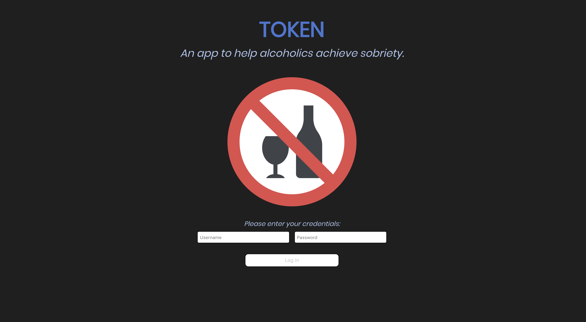
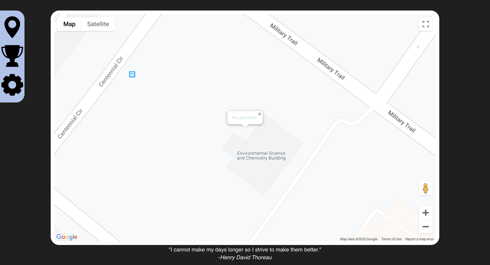

## TOKEN 
 

### Motivation 
Heavy drinking is an issue for 19% of Canadians over the age of twelve.
Recovering from alcoholism is very difficult and almost always requires intervention from family and friends. Unfortunately, due to stigma and other various reasons, this is hard for them to do.

###  Approach

This app will track location when given permission, and will notify a selected loved one when one enters a 'high risk area', such as a bar, pub, liquor store, etc.
This app also tracks progress and rewards tokens when high risk areas are avoided at certain milestones to help motivate users. 
 

###  Technologies

We used `radar.io` to track users to know when to alert selected contacts. From there, we incorporated `twilio` into our `node.js` and `express.js` backend to sent automatic texts to the contacts. For the user interface, we used `react.js`, and `google-maps-api` .

### Resources 
For addictions support, check out [Connex Ontario](https://www.connexontario.ca/).

